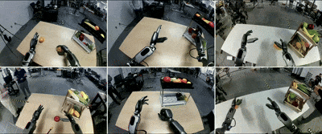
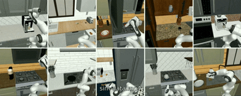
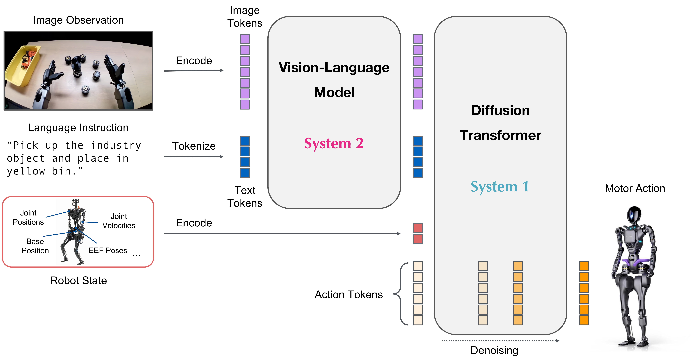
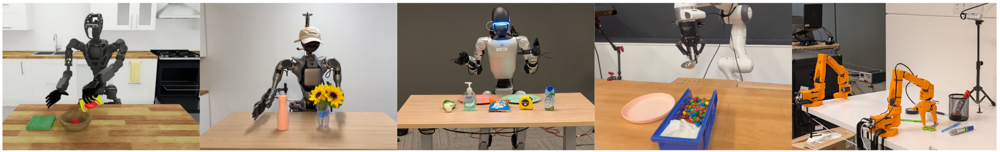
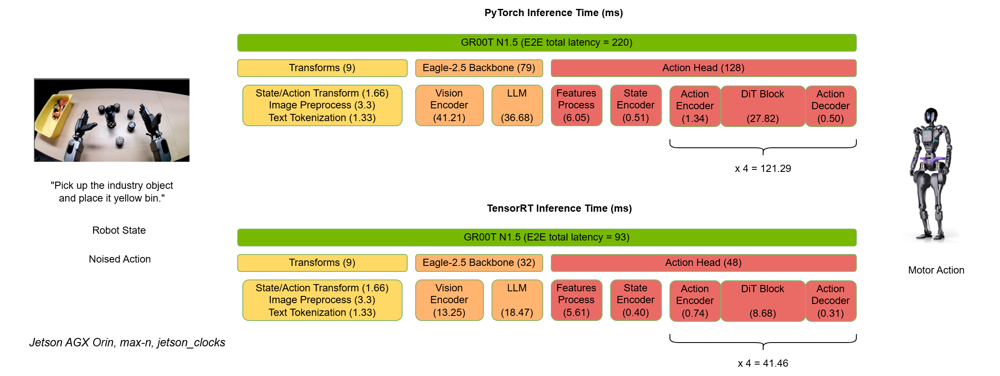

<div align="center">


  
  
  <!-- --- -->
  
  <p style="font-size: 1.2em;">
    <a href="https://developer.nvidia.com/isaac/gr00t"><strong>Website</strong></a> | 
    <a href="https://huggingface.co/nvidia/GR00T-N1.5-3B"><strong>Model</strong></a> |
    <a href="https://huggingface.co/datasets/nvidia/PhysicalAI-Robotics-GR00T-X-Embodiment-Sim"><strong>Dataset</strong></a> |
    <a href="https://arxiv.org/abs/2503.14734"><strong>Paper</strong></a>
  </p>
</div>

[](https://github.com/NVIDIA/Isaac-GR00T/actions/workflows/main.yml)
[](https://github.com/psf/black)
[](https://pycqa.github.io/isort/)
[](https://star-history.com/#NVIDIA/Isaac-GR00T)
[](https://github.com/NVIDIA/Isaac-GR00T/issues)

## NVIDIA Isaac GR00T
## NVIDIA Isaac GR00T（英伟达艾萨克GR00T）

<div align="center">

</div>

> We just released GR00T N1.5, an updated version of GR00T N1 with improved performance and new features. Check out the release blog post (https://research.nvidia.com/labs/gear/gr00t-n1_5/) for more details.
> 
> 我们刚刚发布了GR00T N1.5，这是GR00T N1的更新版本，具有改进的性能和新功能。查看发布博客文章(https://research.nvidia.com/labs/gear/gr00t-n1_5/)了解更多详情。

> To use the older version, N1, please checkout the [n1-release](https://github.com/NVIDIA/Isaac-GR00T/tree/n1-release) release branch.
> 
> 要使用旧版本N1，请检出[n1-release](https://github.com/NVIDIA/Isaac-GR00T/tree/n1-release)发布分支。

NVIDIA Isaac GR00T N1.5 is an open foundation model for generalized humanoid robot reasoning and skills. This cross-embodiment model takes multimodal input, including language and images, to perform manipulation tasks in diverse environments.

NVIDIA Isaac GR00T N1.5是一个开源的通用人形机器人推理和技能基础模型。这个跨具身模型接受多模态输入，包括语言和图像，以在不同环境中执行操作任务。

GR00T N1.5 is trained on an expansive humanoid dataset, consisting of real captured data, synthetic data generated using the components of NVIDIA Isaac GR00T Blueprint ([examples of neural-generated trajectories](./media/videos)), and internet-scale video data. It is adaptable through post-training for specific embodiments, tasks and environments.

GR00T N1.5在一个庞大的人形机器人数据集上进行训练，该数据集包含真实捕获的数据、使用NVIDIA Isaac GR00T Blueprint组件生成的合成数据（[神经生成轨迹示例](./media/videos)）以及互联网规模的视频数据。它可以通过后训练适应特定的具身、任务和环境。

<div align="center">


</div>

The neural network architecture of GR00T N1.5 is a combination of vision-language foundation model and diffusion transformer head that denoises continuous actions. Here is a schematic diagram of the architecture:

GR00T N1.5的神经网络架构是视觉-语言基础模型和扩散变换器头的组合，用于对连续动作进行去噪。以下是架构的示意图：

<div align="center">

</div>

Here is the general procedure to use GR00T N1.5:

以下是使用GR00T N1.5的一般流程：

1. Assume the user has already collected a dataset of robot demonstrations in the form of (video, state, action) triplets. 
2. The user will first convert the demonstration data into the LeRobot compatible data schema (more info in [`getting_started/LeRobot_compatible_data_schema.md`](getting_started/LeRobot_compatible_data_schema.md)), which is compatible with the upstream [Huggingface LeRobot](https://github.com/huggingface/lerobot).
3. Our repo provides examples of different configurations for training with different robot embodiments.
4. Our repo provides convenient scripts for finetuning the pre-trained GR00T N1.5 model on user's data, and running inference.
5. The user will connect the `Gr00tPolicy` to the robot controller to execute actions on their target hardware.

1. 假设用户已经收集了一个机器人演示数据集，以（视频、状态、动作）三元组的形式。
2. 用户首先需要将演示数据转换为LeRobot兼容数据模式（更多信息见[`getting_started/LeRobot_compatible_data_schema.md`](getting_started/LeRobot_compatible_data_schema.md)），该模式与上游[Huggingface LeRobot](https://github.com/huggingface/lerobot)兼容。
3. 我们的代码库提供了不同配置的示例，用于训练不同的机器人具身。
4. 我们的代码库提供了便捷的脚本，用于在用户数据上微调预训练的GR00T N1.5模型并运行推理。
5. 用户需要将`Gr00tPolicy`连接到机器人控制器，以在目标硬件上执行动作。

## What's New in GR00T N1.5
## GR00T N1.5的新特性

GR00T N1.5 represents a significant upgrade over GR00T N1, with improvements in both model architecture and data leading to better performance in many aspects.

GR00T N1.5相比GR00T N1是一个重大升级，在模型架构和数据方面的改进使其在许多方面性能更佳。

### Model and Data Improvements
### 模型和数据改进

- **Frozen VLM**: The vision-language model remains frozen during both pretraining and finetuning, preserving language understanding and improving generalization
- **Enhanced VLM Grounding**: Updated to Eagle 2.5 with improved grounding capabilities and physical understanding, achieving 40.4 IoU on GR-1 grounding tasks (vs 35.5 for Qwen2.5VL).
- **Simplified Adapter**: Streamlined MLP connection between vision encoder and LLM with added layer normalization.
- **FLARE Integration**: Added Future Latent Representation Alignment ([FLARE](https://research.nvidia.com/labs/gear/flare)) objective alongside flow matching loss, enabling effective learning from human ego videos
- **DreamGen Integration**: Incorporated synthetic neural trajectories generated via [DreamGen](https://research.nvidia.com/labs/gear/dreamgen) to enable generalization to novel behaviors and tasks beyond teleoperation data

- **冻结VLM**：视觉-语言模型在预训练和微调期间保持冻结，保持语言理解能力并改善泛化性
- **增强VLM定位**：更新到Eagle 2.5，具有改进的定位能力和物理理解，在GR-1定位任务上达到40.4 IoU（相比Qwen2.5VL的35.5）
- **简化适配器**：简化了视觉编码器和LLM之间的MLP连接，并增加了层归一化
- **FLARE集成**：在流匹配损失的基础上增加了未来潜在表示对齐（[FLARE](https://research.nvidia.com/labs/gear/flare)）目标，实现从人类主观视角视频的有效学习
- **DreamGen集成**：整合了通过[DreamGen](https://research.nvidia.com/labs/gear/dreamgen)生成的合成神经轨迹，使得能够泛化到超越遥操作数据的新行为和任务

### Performance Improvements
### 性能改进

- **Language Following**: Significantly improved language command following versus N1 - 93.3% vs 46.6% on GR-1 manipulation tasks.
- **Data Efficiency**: Better performance in low-data regimes (0-shot and few-shot scenarios)
- **Better Novel Object Generalization**
- **New Embodiment Heads**: Added support for single arm robots with end-effector (EEF) control space via `EmbodimentTag.OXE_DROID` head, and humanoid robots with grippers via `EmbodimentTag.AGIBOT_GENIE1` head, expanding beyond joint space control to enable broader robot compatibility

- **语言跟随**：相比N1显著改进的语言命令跟随能力 - 在GR-1操作任务上达到93.3%对比46.6%
- **数据效率**：在低数据情况下表现更好（零样本和少样本场景）
- **更好的新物体泛化能力**
- **新具身头**：通过`EmbodimentTag.OXE_DROID`头增加了对末端执行器（EEF）控制空间的单臂机器人支持，通过`EmbodimentTag.AGIBOT_GENIE1`头增加了对带夹爪的人形机器人支持，扩展了关节空间控制，实现更广泛的机器人兼容性

These improvements make GR00T N1.5 particularly effective for applications requiring strong language understanding, few-shot adaptation, and generalization to novel objects and environments.
See our GR00T N1.5 [tech blog](https://research.nvidia.com/labs/gear/gr00t-n1_5) for more details on the model and experimental results.

这些改进使GR00T N1.5在需要强语言理解、少样本适应和新物体及环境泛化的应用中特别有效。
查看我们的GR00T N1.5[技术博客](https://research.nvidia.com/labs/gear/gr00t-n1_5)了解模型和实验结果的更多详情。

## Target Audience
## 目标受众

GR00T N1.5 is intended for researchers and professionals in humanoid robotics. This repository provides tools to:

GR00T N1.5面向人形机器人领域的研究人员和专业人士。本代码库提供工具来：

- Leverage a pre-trained foundation model for robot control
- Fine-tune on small, custom datasets
- Adapt the model to specific robotics tasks with minimal data
- Deploy the model for inference

- 利用预训练基础模型进行机器人控制
- 在小型自定义数据集上进行微调
- 用最少的数据将模型适应特定的机器人任务
- 部署模型进行推理

The focus is on enabling customization of robot behaviors through finetuning.

重点是通过微调实现机器人行为的自定义。

## Prerequisites
## 先决条件

- We have tested the code on Ubuntu 20.04 and 22.04, GPU: H100, L40, RTX 4090 and A6000 for finetuning and Python==3.10, CUDA version 12.4.
- For inference, we have tested on Ubuntu 20.04 and 22.04, GPU: RTX 3090, RTX 4090 and A6000.
- If you haven't installed CUDA 12.4, please follow the instructions [here](https://docs.nvidia.com/cuda/cuda-installation-guide-linux/) to install it.
- If you haven't installed tensorrt, please follow the instructions [here](https://docs.nvidia.com/deeplearning/tensorrt/latest/installing-tensorrt/installing.html#) to install it.
- Please make sure you have the following dependencies installed in your system: `ffmpeg`, `libsm6`, `libxext6`

- 我们已在Ubuntu 20.04和22.04上测试代码，GPU：H100、L40、RTX 4090和A6000用于微调，Python==3.10，CUDA版本12.4。
- 对于推理，我们已在Ubuntu 20.04和22.04上测试，GPU：RTX 3090、RTX 4090和A6000。
- 如果您尚未安装CUDA 12.4，请按照[这里](https://docs.nvidia.com/cuda/cuda-installation-guide-linux/)的说明进行安装。
- 如果您尚未安装tensorrt，请按照[这里](https://docs.nvidia.com/deeplearning/tensorrt/latest/installing-tensorrt/installing.html#)的说明进行安装。
- 请确保您的系统已安装以下依赖项：`ffmpeg`、`libsm6`、`libxext6`

## Installation Guide
## 安装指南

Clone the repo:
克隆代码库：

```sh
git clone https://github.com/NVIDIA/Isaac-GR00T
cd Isaac-GR00T
```

Create a new conda environment and install the dependencies. We recommend Python 3.10:
创建新的conda环境并安装依赖项。我们推荐Python 3.10：

> Note that, please make sure your CUDA version is 12.4. Otherwise, you may have a hard time with properly configuring flash-attn module.
> 
> 注意，请确保您的CUDA版本是12.4。否则，您可能难以正确配置flash-attn模块。

```sh
conda create -n gr00t python=3.10
conda activate gr00t
pip install --upgrade setuptools
pip install -e .[base]
pip install --no-build-isolation flash-attn==2.7.1.post4 
```

## Getting started with this repo
## 开始使用本代码库

We provide accessible Jupyter notebooks and detailed documentation in the [`./getting_started`](./getting_started) folder. Utility scripts can be found in the [`./scripts`](./scripts) folder. Additionally, a comprehensive tutorial for finetuning the model on the SO-101 robot is available on [HuggingFace](https://huggingface.co/blog/nvidia/gr00t-n1-5-so101-tuning).
我们在[`./getting_started`](./getting_started)文件夹中提供了易于使用的Jupyter笔记本和详细文档。实用脚本可以在[`./scripts`](./scripts)文件夹中找到。此外，在[HuggingFace](https://huggingface.co/blog/nvidia/gr00t-n1-5-so101-tuning)上提供了在SO-101机器人上微调模型的综合教程。

## 1. Data Format & Loading
## 1. 数据格式和加载

- To load and process the data, we use [Huggingface LeRobot data](https://github.com/huggingface/lerobot), but with a more detailed modality and annotation schema (we call it "LeRobot compatible data schema").
- An example of LeRobot dataset is stored here: `./demo_data/robot_sim.PickNPlace`. (with additional [`modality.json`](./demo_data/robot_sim.PickNPlace/meta/modality.json) file)
- Detailed explanation of the dataset format is available in [`getting_started/LeRobot_compatible_data_schema.md`](getting_started/LeRobot_compatible_data_schema.md)
- We support multiple embodiments with the [`EmbodimentTag`](getting_started/4_deeper_understanding.md#embodiment-action-head-fine-tuning) system.
- Once your data is organized in this format, you can load the data using `LeRobotSingleDataset` class.

- 为了加载和处理数据，我们使用[Huggingface LeRobot数据](https://github.com/huggingface/lerobot)，但使用更详细的模态和注释模式（我们称之为"LeRobot兼容数据模式"）。
- LeRobot数据集的示例存储在这里：`./demo_data/robot_sim.PickNPlace`（附带额外的[`modality.json`](./demo_data/robot_sim.PickNPlace/meta/modality.json)文件）
- 数据集格式的详细说明可在[`getting_started/LeRobot_compatible_data_schema.md`](getting_started/LeRobot_compatible_data_schema.md)中找到
- 我们通过[`EmbodimentTag`](getting_started/4_deeper_understanding.md#embodiment-action-head-fine-tuning)系统支持多种具身。
- 一旦您的数据按此格式组织，您可以使用`LeRobotSingleDataset`类加载数据。

```python
from gr00t.data.dataset import LeRobotSingleDataset
from gr00t.data.embodiment_tags import EmbodimentTag
from gr00t.data.dataset import ModalityConfig
from gr00t.experiment.data_config import DATA_CONFIG_MAP

# get the data config
# 获取数据配置
data_config = DATA_CONFIG_MAP["fourier_gr1_arms_only"]

# get the modality configs and transforms
# 获取模态配置和变换
modality_config = data_config.modality_config()
transforms = data_config.transform()

# This is a LeRobotSingleDataset object that loads the data from the given dataset path.
# 这是一个LeRobotSingleDataset对象，从给定的数据集路径加载数据
dataset = LeRobotSingleDataset(
    dataset_path="demo_data/robot_sim.PickNPlace",
    modality_configs=modality_config,
    transforms=None,  # we can choose to not apply any transforms
                     # 我们可以选择不应用任何变换
    embodiment_tag=EmbodimentTag.GR1, # the embodiment to use
                                     # 要使用的具身
)

# This is an example of how to access the data.
# 这是如何访问数据的示例
dataset[5]
```

- [`getting_started/0_load_dataset.ipynb`](getting_started/0_load_dataset.ipynb) is an interactive tutorial on how to load the data and process it to interface with the GR00T N1.5 model.
- [`scripts/load_dataset.py`](scripts/load_dataset.py) is an executable script with the same content as the notebook.

- [`getting_started/0_load_dataset.ipynb`](getting_started/0_load_dataset.ipynb)是关于如何加载数据并处理以与GR00T N1.5模型接口的交互式教程。
- [`scripts/load_dataset.py`](scripts/load_dataset.py)是与笔记本内容相同的可执行脚本。

Try run the script to load the dataset
尝试运行脚本来加载数据集：
```bash
python scripts/load_dataset.py --dataset-path ./demo_data/robot_sim.PickNPlace
```

## 2. Inference
## 2. 推理

* The GR00T N1.5 model is hosted on [Huggingface](https://huggingface.co/nvidia/GR00T-N1.5-3B)
* Example cross embodiment dataset is available at [demo_data/robot_sim.PickNPlace](./demo_data/robot_sim.PickNPlace)

* GR00T N1.5模型托管在[Huggingface](https://huggingface.co/nvidia/GR00T-N1.5-3B)上
* 跨具身数据集示例可在[demo_data/robot_sim.PickNPlace](./demo_data/robot_sim.PickNPlace)获得

### 2.1 Inference with PyTorch
### 2.1 使用PyTorch进行推理

```python
from gr00t.model.policy import Gr00tPolicy
from gr00t.data.embodiment_tags import EmbodimentTag

# 1. Load the modality config and transforms, or use above
# 1. 加载模态配置和变换，或使用上面的
modality_config = ComposedModalityConfig(...)
transforms = ComposedModalityTransform(...)

# 2. Load the dataset
# 2. 加载数据集
dataset = LeRobotSingleDataset(.....<Same as above>.....)

# 3. Load pre-trained model
# 3. 加载预训练模型
policy = Gr00tPolicy(
    model_path="nvidia/GR00T-N1.5-3B",
    modality_config=modality_config,
    modality_transform=transforms,
    embodiment_tag=EmbodimentTag.GR1,
    device="cuda"
)

# 4. Run inference
# 4. 运行推理
action_chunk = policy.get_action(dataset[0])
```

- [`getting_started/1_gr00t_inference.ipynb`](getting_started/1_gr00t_inference.ipynb) is an interactive Jupyter notebook tutorial to build an inference pipeline.
- [`getting_started/1_gr00t_inference.ipynb`](getting_started/1_gr00t_inference.ipynb)是构建推理管道的交互式Jupyter笔记本教程。

User can also run the inference service using the provided script. The inference service can run in either server mode or client mode.
用户也可以使用提供的脚本运行推理服务。推理服务可以在服务器模式或客户端模式下运行。

```bash
python scripts/inference_service.py --model-path nvidia/GR00T-N1.5-3B --server
```

On a different terminal, run the client mode to send requests to the server.
在另一个终端中，运行客户端模式向服务器发送请求。
```bash
python scripts/inference_service.py  --client
```

### 2.2 Inference with Python TensorRT (Optional)
### 2.2 使用Python TensorRT进行推理（可选）

To inference with ONNX and TensorRT, please refer to [`deployment_scripts/README.md`](deployment_scripts/README.md).
要使用ONNX和TensorRT进行推理，请参考[`deployment_scripts/README.md`](deployment_scripts/README.md)。

## 3. Fine-Tuning
## 3. 微调

Users can run the finetuning script below to finetune the model with the example dataset. A tutorial is available in [`getting_started/2_finetuning.ipynb`](getting_started/2_finetuning.ipynb).
用户可以运行下面的微调脚本，使用示例数据集对模型进行微调。教程可在[`getting_started/2_finetuning.ipynb`](getting_started/2_finetuning.ipynb)中找到。

Then run the finetuning script:
然后运行微调脚本：
```bash
# first run --help to see the available arguments
# 首先运行--help查看可用参数
python scripts/gr00t_finetune.py --help

# then run the script
# 然后运行脚本
python scripts/gr00t_finetune.py --dataset-path ./demo_data/robot_sim.PickNPlace --num-gpus 1
```

**Note**: If you are finetuning on a 4090, you need to pass the `--no-tune_diffusion_model` flag when running `gr00t_finetune.py` to avoid CUDA out of memory.
**注意**：如果您在4090上进行微调，运行`gr00t_finetune.py`时需要传递`--no-tune_diffusion_model`标志以避免CUDA内存不足。

You can also download a sample dataset from our huggingface sim data release [here](https://huggingface.co/datasets/nvidia/PhysicalAI-Robotics-GR00T-X-Embodiment-Sim)
您也可以从我们的huggingface仿真数据发布[这里](https://huggingface.co/datasets/nvidia/PhysicalAI-Robotics-GR00T-X-Embodiment-Sim)下载示例数据集

```
huggingface-cli download  nvidia/PhysicalAI-Robotics-GR00T-X-Embodiment-Sim \
  --repo-type dataset \
  --include "gr1_arms_only.CanSort/**" \
  --local-dir $HOME/gr00t_dataset
```

The recommended finetuning configuration is to boost your batch size to the max, and train for 20k steps.
推荐的微调配置是将批次大小提升到最大，并训练20k步。

*Hardware Performance Considerations*
*硬件性能考虑*
- **Finetuning Performance**: We used 1 H100 node or L40 node for optimal finetuning. Other hardware configurations (e.g. A6000, RTX 4090) will also work but may take longer to converge. The exact batch size is dependent on the hardware, and on which component of the model is being tuned.
- **LoRA finetuning**: We used 2 A6000 GPUs or 2 RTX 4090 GPUs for LoRA finetuning. Users can try out different configurations for effective finetuning.
- **Inference Performance**: For real-time inference, most modern GPUs perform similarly when processing a single sample. Our benchmarks show minimal difference between L40 and RTX 4090 for inference speed.

- **微调性能**：我们使用1个H100节点或L40节点进行最佳微调。其他硬件配置（如A6000、RTX 4090）也能工作，但可能需要更长时间收敛。确切的批次大小取决于硬件以及正在调优的模型组件。
- **LoRA微调**：我们使用2个A6000 GPU或2个RTX 4090 GPU进行LoRA微调。用户可以尝试不同配置进行有效微调。
- **推理性能**：对于实时推理，大多数现代GPU在处理单个样本时性能相似。我们的基准测试显示L40和RTX 4090在推理速度上差异很小。

For new embodiment finetuning, checkout our notebook in [`getting_started/3_0_new_embodiment_finetuning.md`](getting_started/3_0_new_embodiment_finetuning.md).
对于新具身微调，请查看我们在[`getting_started/3_0_new_embodiment_finetuning.md`](getting_started/3_0_new_embodiment_finetuning.md)中的笔记本。

### Choosing the Right Embodiment Head
### 选择正确的具身头

<div align="center">

</div>

GR00T N1.5 provides three pretrained embodiment heads optimized for different robot configurations:
GR00T N1.5提供三个针对不同机器人配置优化的预训练具身头：

- **`EmbodimentTag.GR1`**: Designed for humanoid robots with dexterous hands using absolute joint space control
- **`EmbodimentTag.OXE_DROID`**: Optimized for single arm robots using delta end-effector (EEF) control  
- **`EmbodimentTag.AGIBOT_GENIE1`**: Built for humanoid robots with grippers using absolute joint space control
- **`EmbodimentTag.NEW_EMBODIMENT`**: (Non-pretrained) New embodiment head for finetuning on new robot embodiments

- **`EmbodimentTag.GR1`**：专为使用绝对关节空间控制的灵巧手人形机器人设计
- **`EmbodimentTag.OXE_DROID`**：针对使用增量末端执行器（EEF）控制的单臂机器人优化
- **`EmbodimentTag.AGIBOT_GENIE1`**：为使用绝对关节空间控制的带夹爪人形机器人构建
- **`EmbodimentTag.NEW_EMBODIMENT`**：（非预训练）用于在新机器人具身上微调的新具身头

Select the embodiment head that best matches your robot's configuration for optimal finetuning performance. For detailed information on the observation and action spaces, see [`EmbodimentTag`](getting_started/4_deeper_understanding.md#embodiment-action-head-fine-tuning).
选择最匹配您机器人配置的具身头以获得最佳微调性能。有关观察和动作空间的详细信息，请参见[`EmbodimentTag`](getting_started/4_deeper_understanding.md#embodiment-action-head-fine-tuning)。

## 4. Evaluation
## 4. 评估

To conduct an offline evaluation of the model, we provide a script that evaluates the model on a dataset and plots it out. Quick try: `python scripts/eval_policy.py --plot --model_path nvidia/GR00T-N1.5-3B`
为了对模型进行离线评估，我们提供了一个脚本，该脚本在数据集上评估模型并绘制结果。快速尝试：`python scripts/eval_policy.py --plot --model_path nvidia/GR00T-N1.5-3B`

Or you can run the newly trained model in client-server mode.
或者您可以在客户端-服务器模式下运行新训练的模型。

Run the newly trained model
运行新训练的模型：
```bash
python scripts/inference_service.py --server \
    --model-path <MODEL_PATH> \
    --embodiment-tag new_embodiment
    --data-config <DATA_CONFIG>
```

Run the offline evaluation script
运行离线评估脚本：
```bash
python scripts/eval_policy.py --plot \
    --dataset-path <DATASET_PATH> \
    --embodiment-tag new_embodiment \
    --data-config <DATA_CONFIG>
```

You will then see a plot of Ground Truth vs Predicted actions, along with unnormed MSE of the actions. This would give you an indication if the policy is performing well on the dataset.
然后您将看到真实值与预测动作的对比图，以及动作的未归一化MSE。这将让您了解策略在数据集上是否表现良好。

## Jetson Deployment
## Jetson部署

A detailed guide for deploying GR00T N1.5 on Jetson is available in [`deployment_scripts/README.md`](deployment_scripts/README.md).
在Jetson上部署GR00T N1.5的详细指南可在[`deployment_scripts/README.md`](deployment_scripts/README.md)中找到。

Here's comparison of E2E performance between PyTorch and TensorRT on Orin
以下是在Orin上PyTorch和TensorRT的端到端性能比较：

<div align="center">

</div>

Model latency measured by `trtexec` with batch_size=1.     
模型延迟由`trtexec`测量，batch_size=1。
| Model Name                                     |Orin benchmark perf (ms)  |Precision|
|:----------------------------------------------:|:------------------------:|:-------:|
| Action_Head - process_backbone_output          | 5.17                     |FP16     |
| Action_Head - state_encoder                    | 0.05                     |FP16     |
| Action_Head - action_encoder                   | 0.20                     |FP16     |
| Action_Head - DiT                              | 7.77                     |FP16     |
| Action_Head - action_decoder                   | 0.04                     |FP16     |
| VLM - ViT                                      |11.96                     |FP16     |
| VLM - LLM                                      |17.25                     |FP16     |  
      
**Note**: The module latency (e.g., DiT Block) in pipeline is slightly longer than the model latency in benchmark table above because the module (e.g., Action_Head - DiT) latency not only includes the model latency in table above but also accounts for the overhead of data transfer from PyTorch to TRT and returning from TRT to PyTorch.
**注意**：管道中的模块延迟（例如DiT Block）比上述基准表中的模型延迟稍长，因为模块（例如Action_Head - DiT）延迟不仅包括上表中的模型延迟，还考虑了从PyTorch到TRT以及从TRT返回到PyTorch的数据传输开销。

# FAQ
# 常见问题

*Does it work on CUDA ARM Linux?*
*它能在CUDA ARM Linux上运行吗？*
- Yes, visit [jetson-containers](https://github.com/dusty-nv/jetson-containers/tree/master/packages/robots/Isaac-GR00T). 
- 是的，访问[jetson-containers](https://github.com/dusty-nv/jetson-containers/tree/master/packages/robots/Isaac-GR00T)。

*I have my own data, what should I do next for finetuning?*
*我有自己的数据，接下来应该做什么来进行微调？*
- This repo assumes that your data is already organized according to the LeRobot format. 
- 本代码库假设您的数据已按LeRobot格式组织。


*What is Modality Config? Embodiment Tag? and Transform Config?*
*什么是模态配置？具身标签？变换配置？*
- Embodiment Tag: Defines the robot embodiment used, non-pretrained embodiment tags are all considered as `new_embodiment`.
- Modality Config: Defines the modalities used in the dataset (e.g. video, state, action)
- Transform Config: Defines the Data Transforms applied to the data during dataloading.
- For more details, see [`getting_started/4_deeper_understanding.md`](getting_started/4_deeper_understanding.md)

- 具身标签：定义使用的机器人具身，非预训练的具身标签都被视为`new_embodiment`。
- 模态配置：定义数据集中使用的模态（例如视频、状态、动作）
- 变换配置：定义数据加载期间应用于数据的数据变换。
- 更多详情见[`getting_started/4_deeper_understanding.md`](getting_started/4_deeper_understanding.md)

*What is the inference speed for Gr00tPolicy?*
*Gr00tPolicy的推理速度是多少？*

Below are benchmark results based on a single H100 GPU. Performance will be slightly slower on consumer GPUs like RTX 4090 for inference (single sample processing):
以下是基于单个H100 GPU的基准测试结果。在消费级GPU如RTX 4090上进行推理（单样本处理）时性能会稍慢：

| Module | Inference Speed |
|----------|------------------|
| VLM Backbone | 23.18 ms |
| Action Head with 4 diffusion steps | 4 x 6.18 ms = 24.7 ms |
| Full Model | 47.88 ms |

We noticed that 4 denoising steps are sufficient during inference.
我们注意到推理期间4个去噪步骤就足够了。

*How to train with multiple datasets?*
*如何使用多个数据集进行训练？*

You can train with multiple datasets by providing a list of dataset paths to the `dataset_path` argument.
您可以通过向`dataset_path`参数提供数据集路径列表来使用多个数据集进行训练。

```bash
python scripts/gr00t_finetune.py --dataset-path <DATASET1> <DATASET2> --num-gpus 1
```

By default, the `gr00t_finetune.py` imposes equal weights to all datasets, with `balance_dataset_weights` and `balance_trajectory_weights` set to `True`. For more details, see the `LeRobotMixtureDataset` class definition in `gr00t/data/dataset.py`. Users can also use the `LeRobotMixtureDataset` class directly to train with multiple datasets with different embodiments, transforms, and sampling weights.
默认情况下，`gr00t_finetune.py`对所有数据集施加相等权重，`balance_dataset_weights`和`balance_trajectory_weights`设置为`True`。更多详情见`gr00t/data/dataset.py`中的`LeRobotMixtureDataset`类定义。用户也可以直接使用`LeRobotMixtureDataset`类来训练具有不同具身、变换和采样权重的多个数据集。

*Is LoRA finetuning supported?*
*支持LoRA微调吗？*

Yes, you can use LoRA finetuning to finetune the model. This can be enabled by indicating `--lora_rank 64  --lora_alpha 128` in the finetuning script. However, we recommend using the full model finetuning for better performance.
是的，您可以使用LoRA微调来微调模型。这可以通过在微调脚本中指示`--lora_rank 64 --lora_alpha 128`来启用。但是，我们建议使用完整模型微调以获得更好的性能。

# Contributing
# 贡献

For more details, see [CONTRIBUTING.md](CONTRIBUTING.md)
更多详情见[CONTRIBUTING.md](CONTRIBUTING.md)


## License 
## 许可证

```
# SPDX-FileCopyrightText: Copyright (c) 2025 NVIDIA CORPORATION & AFFILIATES. All rights reserved.
# SPDX-License-Identifier: Apache-2.0
#
# Licensed under the Apache License, Version 2.0 (the "License");
# you may not use this file except in compliance with the License.
# You may obtain a copy of the License at
#
# http://www.apache.org/licenses/LICENSE-2.0
#
# Unless required by applicable law or agreed to in writing, software
# distributed under the License is distributed on an "AS IS" BASIS,
# WITHOUT WARRANTIES OR CONDITIONS OF ANY KIND, either express or implied.
# See the License for the specific language governing permissions and
# limitations under the License.
```
