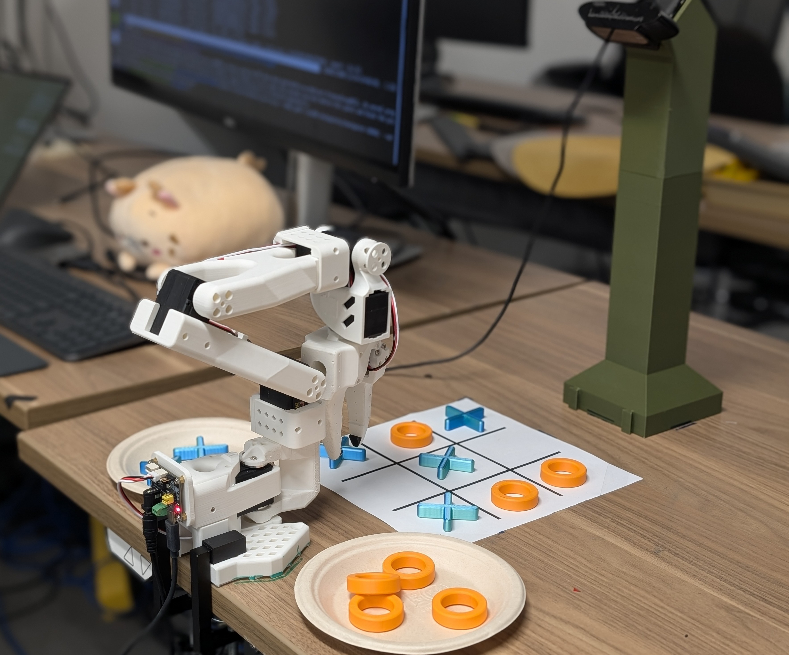
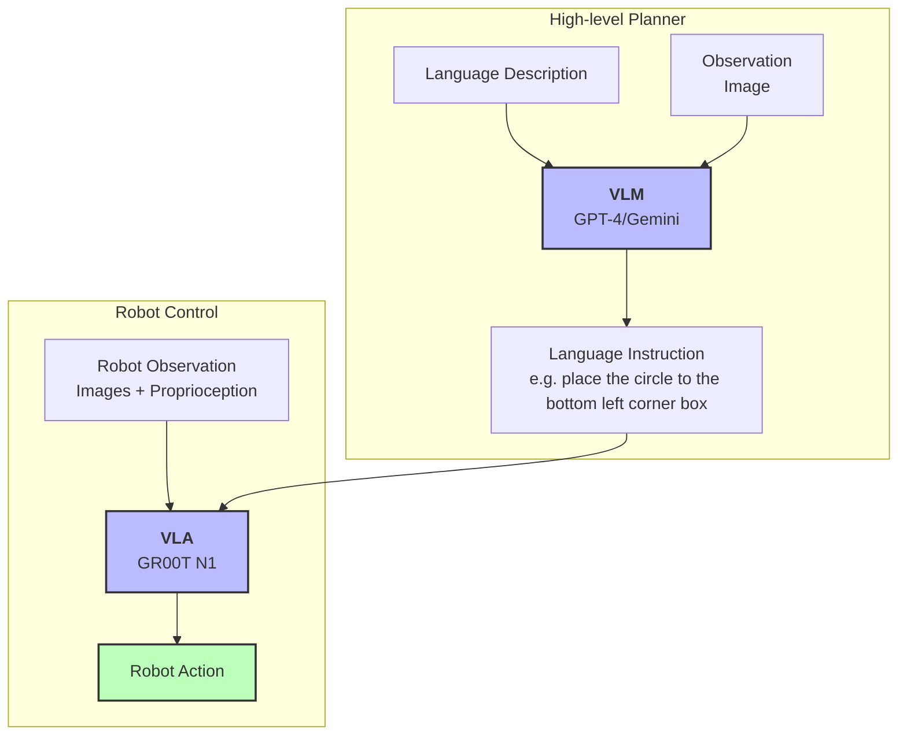

# Examples
# 示例

## Modality.json
## Modality.json

This provides additional examples of `modality.json` for different lerobot datasets. Copy the relevant `modality.json` to the dataset`<DATASET_PATH>/meta/modality.json`
本节为不同 lerobot 数据集提供了额外的 `modality.json` 示例。请将相关的 `modality.json` 复制到数据集 `<DATASET_PATH>/meta/modality.json` 路径下。

## Eval GR00T N1 on SO100 and SO101
## 在 SO100 和 SO101 上评估 GR00T N1

 - [eval_lerobot.py](./eval_lerobot.py): script to evaluate policy.
 - [eval_lerobot.py](./eval_lerobot.py)：用于评估策略的脚本。
 - [eval_gr00t_so100.py](./eval_gr00t_so100.py) provides an example of how to use the finetuned model to run policy rollouts on a SO100 robot arm. (Before [Lerobot API redesign PR](https://github.com/huggingface/lerobot/pull/777))
 - [eval_gr00t_so100.py](./eval_gr00t_so100.py) 提供了一个示例，展示如何使用微调后的模型在 SO100 机械臂上运行策略 rollout。（在 [Lerobot API redesign PR](https://github.com/huggingface/lerobot/pull/777) 之前）

> NOTE: This scripts meant to serve as a template, user will need to modify the script to run on a real robot.
> 注意：这些脚本仅作为模板，用户需要根据实际机器人进行修改后才能运行。


## Tic-Tac-Toe Bot
## 井字棋机器人





This showcases the example of using a VLM as a high-level task planner (system 2) to plan the next action in a tic-tac-toe game, and GR00T N1 as the low-level action executor (system 1). This showcases language-conditioned on a GR00T N1 VLA. (e.g. "Place the circle to the bottom left corner box")
本例展示了如何使用 VLM 作为高级任务规划器（系统2）来规划井字棋游戏中的下一步动作，并使用 GR00T N1 作为低级动作执行器（系统1）。这展示了基于语言条件的 GR00T N1 VLA。（例如：“将圆圈放在左下角的格子里”）

 * Example script: [tictac_bot.py](./tictac_bot.py)
 * 示例脚本：[tictac_bot.py](./tictac_bot.py)
 * [Example dataset](https://huggingface.co/datasets/youliangtan/tictac-bot)
 * [示例数据集](https://huggingface.co/datasets/youliangtan/tictac-bot)

```bash
# server
# 服务器
python scripts/inference_service.py --model_path <YOUR_CHECKPOINT_PATH> --server --data_config so100  --embodiment_tag new_embodiment

# client NOTE: this shouldn't run as it is, user will need to modify the script with relevant configs to make it work.
# 客户端 注意：此命令不能直接运行，用户需要根据实际配置修改脚本才能正常工作。
python tictac_bot.py
```
